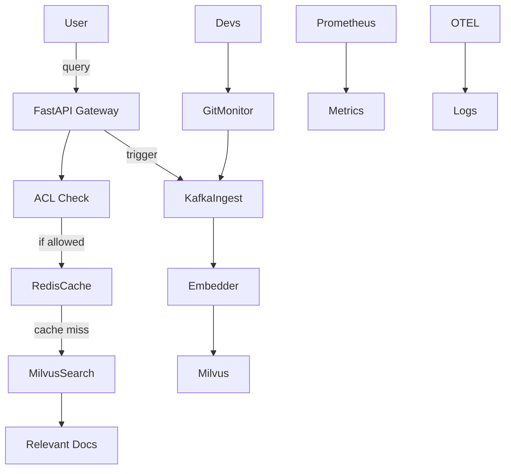
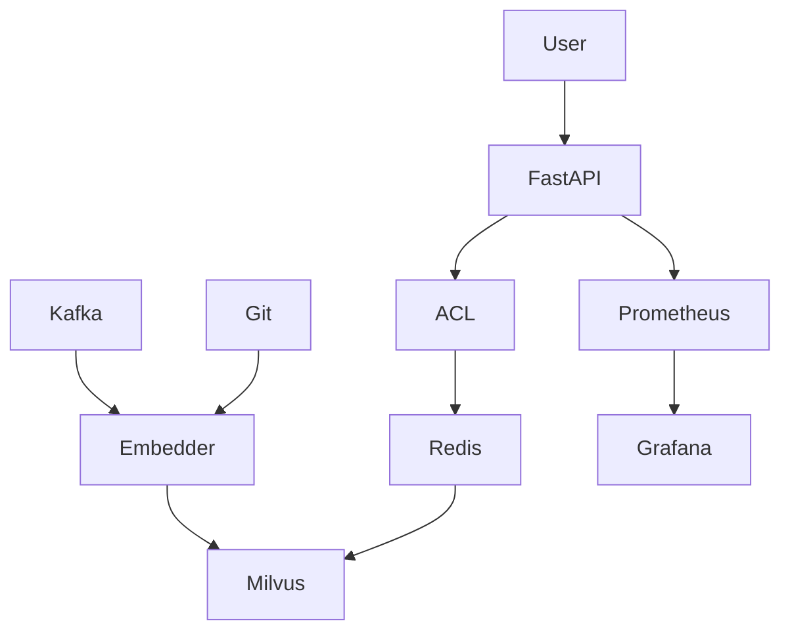

```mermaid
graph TD
    User -->|query| API[FastAPI Gateway]
    API --> ACL[ACL Check]
    ACL -->|if allowed| RedisCache
    RedisCache -->|cache miss| MilvusSearch
    MilvusSearch --> Result[Relevant Docs]
    API -->|trigger| KafkaIngest
    Devs --> GitMonitor --> KafkaIngest
    KafkaIngest --> Embedder
    Embedder --> Milvus
    Prometheus --> Metrics
    OTEL --> Logs
```

```mermaid
flowchart TD
    Kafka --> Embedder
    Git --> Embedder
    Embedder --> Milvus
    User --> FastAPI --> ACL --> Redis --> Milvus
    FastAPI --> Prometheus --> Grafana
```
